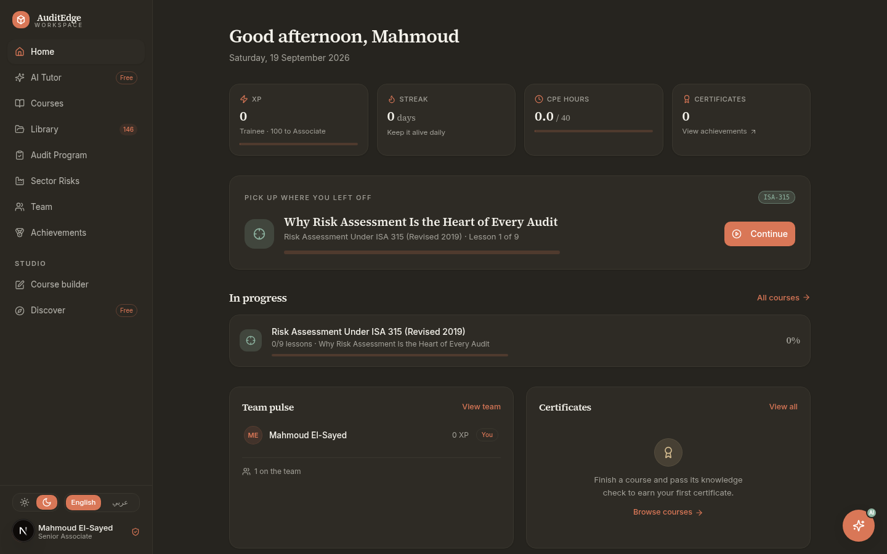
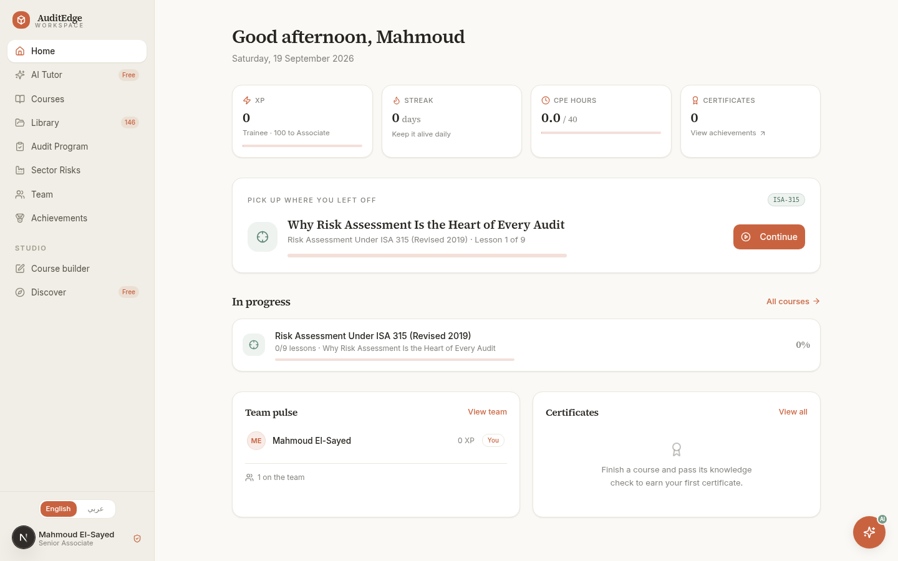
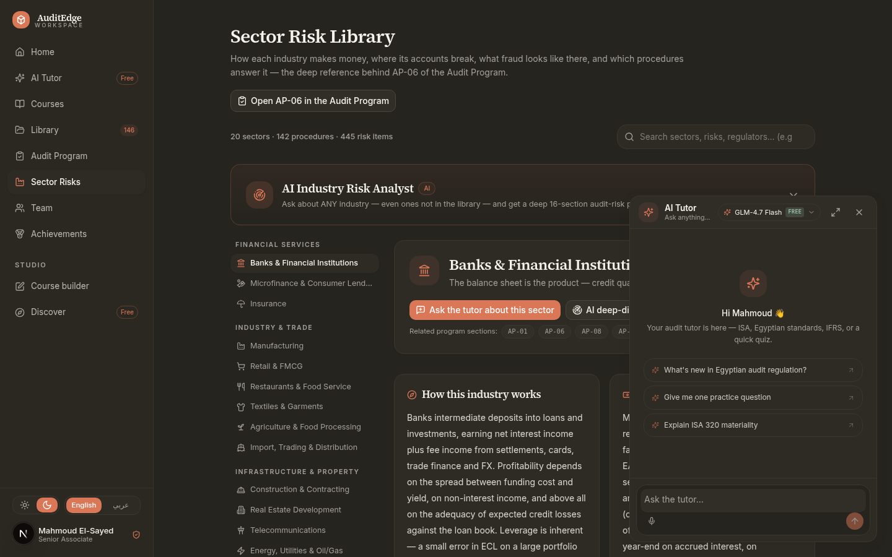
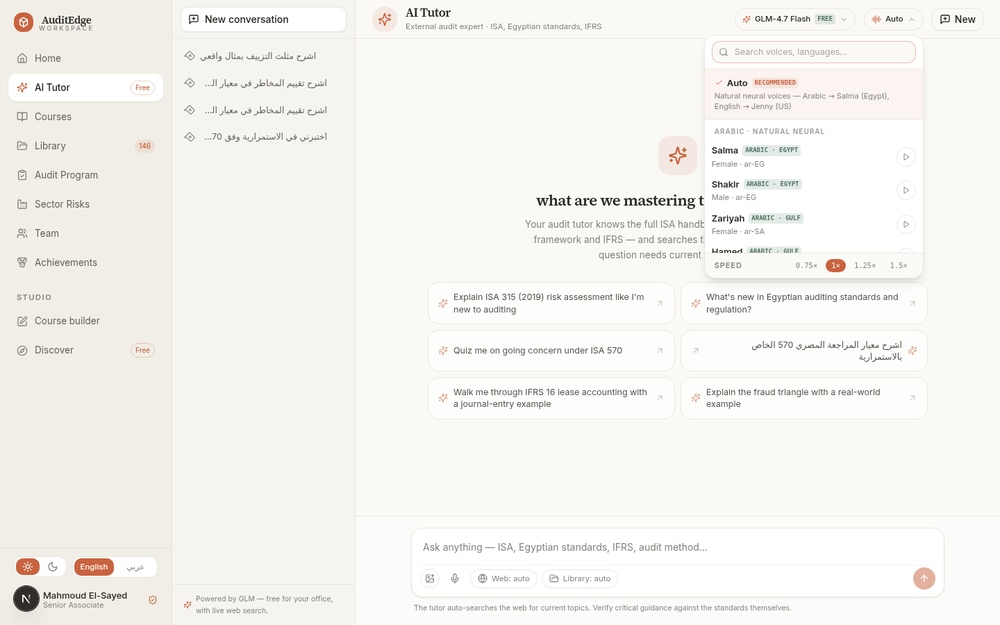

# AuditEdge Academy

**A bilingual (English / العربية) AI-powered academy for audit and accounting professionals — one workspace for ISA & IFRS exam prep, a 20-industry risk library, AI fieldwork assistants, and 23 neural voices that read English and Arabic beautifully.**




## About

AuditEdge Academy is a personal learning workspace built for a Senior Associate in external audit (Egypt) — designed to feel like a professional tool, not a course catalog. It carries **41 courses and 990 lessons** across the full ISA framework, IFRS core standards and the Egyptian regulatory environment (FRA decrees, Egyptian Standards on Auditing, Companies Law 159/1981), plus **146 library materials** including official standard texts, **43 full video courses** (now including advanced Excel and Word in Arabic and English) with real YouTube thumbnails, and **115 past papers across every track** — the entire ACCA syllabus, the IFRS diploma, Egyptian practice, CPA AUD/FAR/REG, CFA Level I and CMA Parts 1 & 2 (2,685-question bilingual bank).

Around the curriculum sits an AI suite: a tutor that grounds its answers in your own library (RAG with cited excerpts), an industry risk analyst that streams sector-specific risk profiles, a Key Audit Matters drafter, and a trial-balance / journal-entry analyzer. Read-aloud is powered by 23 voices across two engines — including Egyptian and Gulf Arabic neural voices — with an Auto mode that matches the language of whatever is being read.

Everything is bilingual (full RTL, not just translated strings), themeable (light/dark, FOUC-free), installable (PWA with offline lessons), and private (single-user, passwordless, no trackers).

## Screenshots

| Arabic RTL | Dark theme |
|:---:|:---:|
|  |  |
| *Full right-to-left layout across every view* | *Theme-aware tokens, OS-preference aware* |

| AI Tutor | Voice catalog |
|:---:|:---:|
|  |  |
| *Streaming answers grounded in the library* | *23 voices, searchable, with per-voice previews* |

## Features

### Curriculum and library
- **41 courses / 990 lessons + the IFRS 18 course** — ISA 315, 330, 240, 570, EVD 500, IFRS core, the Egyptian FRA framework, audit analytics, plus curated Arabic IFRS & auditing playlists — every course carries a designed pro thumbnail
- **43 full video courses playable in-app** — audit (CPA Talks Audit 101, FinanceSkul F8/AA, Ruchi Goyal, Bisk CPA AUD), IFRS (CPA Talks standards, BotCast, CPDbox, Tashwita, the full DipIFR diploma and CertIFR session courses), **CFA Level I** (the complete FinTree 8-session crash course + QuintEdge Ethics + edZeb marathons), **the complete Arabic CMA Part 1 & 2 and CPA AUD & FAR playlist courses** (30 + 19 + 21 + 27 lectures), Excel and Word (Al Assaal and Qonswa in Arabic, TrumpExcel and Learn Skills Daily in English), Dr. Zuhair's 81-lecture Arabic IAS/IFRS standards library, and the Course Illustrator design track — every course is a full playlist, and one-video courses are badged "Full course · 1 video"
- **146 library materials** with official standard texts — searchable, excerpt-served
- **Past papers for EVERY course track** — 23 exam families × five sittings each (115 papers): the entire ACCA syllabus (BT…AAA), the IFRS diploma, the Egyptian SOE paper, **CPA AUD/FAR/REG, CFA Level I and CMA Parts 1 & 2**, over a 2,685-question bilingual bank, plus AI-generated custom exams in micro / mini / standard / full sizes. Eleven families sit in their REAL exam format — CPA two-MCQ-testlets-plus-TBS at 50/50, DipIFR/ACCA FR Section A 30% + Section B 70%, ACCA AA three sections, SBL/SBR pure scenario papers, CMA 75% MCQ + 25% essays, CFA two timed sessions — with 35 written tasks (81 requirements) marked by the **AI examiner against certified solutions**, and a per-exam picker dialog to choose between the previous papers. The Courses page carries a "Past papers & exams for every track" strip that deep-links into the papers grid
- **Podcasts that play in the website** — a global sticky player streams lesson episodes while you browse (queue, speed, Media-Session controls), plus 53 curated YouTube episodes **each titled in English AND Arabic** with bilingual search ("qawain" and "قوائم" both land the Qawaim accounting podcast)
- **Make your own podcast, by the AI** — pick the topic, language (EN/AR), length (10/15/20 min), style (interview / guided lesson / friendly debate / exam coaching) and host names; the AI writes a real two-person script and two different neural voices play it in the sticky player (or download the MP3)
- **Discover & Import** — search Coursera, MIT OCW, edX, OpenStax and YouTube, import as courses
- Quizzes with certificates, XP, streaks and achievements with live earn-progress
- Video lessons, lesson builder and full admin tooling

### AI suite
- **AI Tutor** — full page and floating popup, streaming answers, RAG over your library with cited excerpts, persistent conversations, and a tutor persona that encodes the full IFAC / IAASB / IESBA architecture plus the Egyptian regulatory map
- **AI Industry Risk Analyst** — streaming risk profiles for 20 sectors, with deep-dive presets
- **KAM drafter** — drafts Key Audit Matters from your program findings
- **TB & JE analyzer** — trial balance and journal-entry analysis (Benford's law, JE testing)
- **Vision** — attach an image (a reconciliation screenshot, a ledger extract) to your question
- **Model switcher** — GLM-4.7-Flash (default, reasoning, free tier), GLM-4.6V-Flash (vision, free tier), GLM-4-Plus, with graceful fallback

### Read-aloud and dictation
- **16 Microsoft Edge neural voices** — Salma & Shakir (Egyptian Arabic), Zariyah & Hamed (Gulf Arabic), Jenny & Guy (US English), Sonia & Ryan (UK English), Natasha (AU), Neerja (IN), Denise (FR), Elvira (ES), Katja (DE), Elsa (IT), Emel (TR), Swara (HI)
- **7 built-in Z.ai voices** as a fallback engine
- **Auto mode** routes each text to a native voice by language — Arabic answers are read by Salma, English by Jenny
- Searchable grouped picker with per-voice previews and speed control (0.75x - 1.5x)
- Speech-to-text dictation in the composer
- **Automatic answer reading** — the tutor speaks every answer as it finishes (persisted toggle)
- **Hands-free voice conversation** — after each spoken answer the mic opens, transcribes your next question and sends it: a zero-click speak/listen loop

### Engagement workspace
- **Audit Program** — the full external audit cycle as a working tool: risk core, materiality calculator, PBC lists, findings, signoffs
- Fully bilingual program — every section in English and Arabic

### Platform
- Full RTL Arabic across every view
- Dark and light themes — persisted, OS-preference aware, no flash of unstyled theme
- PWA — installable, offline lessons via service worker
- Single-user by design — the app simply opens; no accounts, no trackers
- SQLite + Prisma, Next.js standalone output

## AI architecture

- All model traffic proxies through server routes — the API key never reaches the browser
- The tutor retrieves over the materials library (scored PDF/text excerpts) and cites what it used
- The system prompt encodes the IFAC standard-setting architecture (who issues what), the Egyptian oversight map (FRA, CBE, Law 159/1981, PM Decree 3725/2025) and audit craft from engagement acceptance to partner review
- A model router serves all three GLM models with balance-aware fallback

## The voice engine (reverse-engineered, key-free)

The 16 international voices are served by a from-scratch TypeScript client for Microsoft Edge's read-aloud neural TTS service (`src/lib/edge-tts.ts`):

- WSS handshake against `speech.platform.bing.com` with a current-Chromium user agent, `muid` cookie and the `Sec-MS-GEC` DRM token (SHA-256 over clock-skew-corrected Windows-epoch ticks)
- SSML synthesis with per-voice prosody — the app's 0.75x - 1.5x speed range maps to SSML rate adjustments
- Binary frame reassembly (2-byte big-endian header length, `Path:audio` chunks reassembled into MP3)
- Clock-skew retry recovered from the 403 `Date` header, plus a silent fallback to the Z.ai voices if the service is unreachable

Adding a voice is a data change, not a code change: append an `EdgeVoiceInfo` entry in `src/lib/voices.ts`.

## Tech stack

| Layer | Choice |
|---|---|
| Framework | Next.js 16 (App Router, standalone output) |
| UI | React 19, Tailwind CSS 4, shadcn/ui, Radix primitives, Framer Motion |
| Language | TypeScript 5 (strict) |
| State | Zustand (persisted preferences), TanStack Query & Table |
| Data | Prisma 6 + SQLite |
| AI | Z.ai GLM-4.7-Flash / GLM-4.6V-Flash / GLM-4-Plus via OpenAI-compatible streaming |
| Speech | Microsoft Edge neural TTS (custom WSS client), Z.ai TTS fallback, ASR dictation |
| Runtime & tooling | Bun, ESLint 9, GitHub Actions (workflow config included) |

## Getting started

### Prerequisites

- [Bun](https://bun.sh) 1.2+ (the lockfile is Bun's; Node 20+ with npm also works if you regenerate the lockfile)
- A Z.ai API key for the AI features (the free tier covers GLM-4.7-Flash and GLM-4.6V-Flash) — optional; everything else works without it

### Setup

```bash
git clone https://github.com/mahmoudmohamedxx1-hue/auditedge.git
cd auditedge
bun install
cp .env.example .env.local      # add your ZAI_OPEN_API_KEY for the AI features
bun run db:push                 # create the SQLite schema
bun run dev
```

Open http://localhost:3000 — the workspace boots straight in (single-user, passwordless; the account is provisioned automatically on first request).

Optional — seed the 8 in-house standards courses (ISA 315 / 330 / 240 / 570, EVD 500, IFRS core, the Egyptian FRA framework, audit analytics):

```bash
bun scripts/seed/index.ts I-UNDERSTAND-THIS-WIPES-THE-DB
```

### Environment variables

| Variable | Required | Default | Purpose |
|---|---|---|---|
| `DATABASE_URL` | yes | `file:./db/custom.db` | SQLite database file |
| `ZAI_OPEN_API_KEY` | for real-GLM answers | — | Z.ai open-platform API key (serves the GLM-5.3 Flash flagship directly) |
| `ZAI_OPEN_BASE_URL` | no | `https://api.z.ai/api/paas/v4` | API base URL override |
| `LLM7_API_KEY` | no | — | FREE key from [dash.llm7.io](https://dash.llm7.io) — unlocks the real `glm-5.3` route on LLM7 (reasoning-capable) with zero cost; without it the tutor still works via the keyless community pool |

## Deploying to Vercel

The repo deploys as-is — [`vercel.json`](vercel.json) runs `prisma generate` before
the build, and a sanitized content snapshot ships at `prisma/auditedge-demo.db.gz`
(30 courses, 933 lessons, 146 materials, the single workspace user — zero personal
runtime data). On Vercel the serverless filesystem is read-only, so on first request
`src/lib/db.ts` unpacks that snapshot into the instance's temp directory and points
Prisma at it there.

1. Import the repo on Vercel (Next.js is auto-detected; the build command comes from `vercel.json`)
2. Add `ZAI_OPEN_API_KEY` under Settings → Environment Variables if you want the AI tutor, analyst and KAM drafter live
3. To make the deployment publicly reachable, set Settings → Deployment Protection to **Disabled** (by default Vercel puts deployments behind a login wall that only your account can pass)
4. Deploy

Two things to know about the deployed copy: writes (lesson progress, quiz attempts,
AI chats) live per-instance and reset when the function recycles — the canonical
workspace is your local database; and after changing course content locally, refresh
the snapshot with `bun scripts/make-vercel-snapshot.ts` and push.

### Durable data on Vercel (P1-7)

The snapshot mode above is the zero-config demo. For a deployment where user data
**survives redeploys**, attach a managed Postgres database:

1. Create a free Postgres database (Neon, Supabase or Vercel Postgres) and copy its
   connection string
2. On Vercel → Settings → Environment Variables, set `DATABASE_URL` to that
   `postgres://…` string (replacing the default `file:./db/custom.db`)
3. Redeploy — `scripts/db-deploy.ts` runs during the build, switches the Prisma
   provider to postgresql, pushes the schema, and the app then reads and writes
   the managed database directly

Until you do this, treat the deployment as read-mostly: use **Library → Your data →
Export** before a redeploy and **Import** afterwards to carry your progress over
(the JSON carries progress, notes, review queue, exam history and AI conversations).

## Scripts

| Command | What it does |
|---|---|
| `bun run dev` | Dev server on port 3000 |
| `bun run build` | Production build (standalone output) |
| `bun run start` | Serve the standalone production build |
| `bun run lint` | ESLint across the repo |
| `bun run db:push` | Sync the Prisma schema to SQLite |
| `bun scripts/seed/index.ts I-UNDERSTAND-THIS-WIPES-THE-DB` | Re-seed the 8 in-house courses (destructive) |
| `bun scripts/make-vercel-snapshot.ts` | Rebuild the sanitized `prisma/auditedge-demo.db.gz` deployment snapshot |

## Verification and testing

The repo ships with the verification suites used during development:

| Suite | Checks | Covers |
|---|---|---|
| `bun scripts/test-v26.ts` | 66 | Bilingual findable podcasts, the AI podcast studio (routes/player/guard), full playlist courses, CPA/CFA/CMA track papers + seeded bank |
| `bun scripts/test-v25.ts` | 51 | Five sittings per exam family, the IFRS diploma family, generator determinism/uniqueness, Arabic track courses, real conversation podcasts |
| `bun scripts/test-sectors-v15.ts` | 515 | 20 sector risk profiles — risk matrices, assertions, deep-dive presets |
| `bun scripts/test-sectors-v13.ts` | 351 | Sector library structural integrity |
| `bun scripts/test-engagement-v12.ts` | 28 | Audit-program engagement objects |
| `bun scripts/test-models-v15.ts` | 14 | Live GLM streaming for all three models (needs `ZAI_OPEN_API_KEY`) |

A ready-to-run GitHub Actions workflow ships at [`docs/ci-workflow.yml`](docs/ci-workflow.yml) — lint, typecheck and a production build on every push and pull request. GitHub only accepts workflow files through the web UI or a `workflow`-scoped token, so to switch CI on: copy the file to `.github/workflows/ci.yml` (the GitHub web editor works) and commit.

## Project structure

```
auditedge/
├── docs/screenshots/            # UI captures (light, dark, Arabic RTL)
├── prisma/schema.prisma         # SQLite schema — users, courses, lessons,
│                                #   progress, quizzes, AI conversations
├── public/                      # PWA manifest, icons, service worker
├── scripts/
│   ├── seed/                    # 8 in-house standards courses
│   ├── test-sectors-v15.ts      # 515-check sector suite
│   ├── test-models-v15.ts       # 14-check live GLM suite
│   └── ...                      # verification, migration and ops tooling
└── src/
    ├── app/
    │   ├── api/                 # 27 routes — AI (chat, tts, asr, industry,
    │   │                        #   kam), courses, progress, materials,
    │   │                        #   team, files, auth, bootstrap
    │   ├── layout.tsx           # fonts, theme pre-paint, app shell
    │   └── page.tsx             # single-page workspace shell
    ├── components/
    │   ├── audit/               # the app — tutor, analyst, program, sectors,
    │   │                        #   library, player, voice picker, KAM drafter
    │   └── ui/                  # shadcn/ui primitives
    ├── lib/
    │   ├── ai.ts                # GLM routing, RAG, tutor & analyst prompts
    │   ├── edge-tts.ts          # Microsoft Edge neural TTS client (WSS + SSML)
    │   ├── voices.ts            # 23-voice catalog + language routing
    │   ├── program/             # audit program + 20 sector risk profiles
    │   └── i18n.ts              # EN/AR dictionaries
    └── store/useAppStore.ts     # Zustand state + localStorage persistence
```

## Roadmap

- Trust and verification layer over AI answers — an inline verification pass over tutor / analyst output before display
- Read-aloud in the lesson player, plus per-voice volume control
- More neural voices and languages (the catalog is data-driven)
- Scheduled library backups and exports

## Security

- Secrets live only in `.env*` files (gitignored) — no keys in the repo or the client bundle; every AI call proxies through server routes
- Single-user and passwordless by design — no third-party trackers or analytics
- The tutor grounds answers in the local library and shows the excerpts it used

## License

Released under the [MIT License](LICENSE).

## Acknowledgements

- Content sources: IAASB Handbook, IFAC, Egyptian FRA decree texts (Egyptian Accounting & Auditing Standards), IFRS Foundation publications
- Voices: Microsoft Edge read-aloud neural voices, Z.ai TTS
- AI: Z.ai GLM-4.7-Flash, GLM-4.6V-Flash, GLM-4-Plus
- Built with Next.js, Tailwind CSS, shadcn/ui, Prisma and Bun

---

**Built by [Mahmoud El-Sayeed](https://github.com/mahmoudmohamedxx1-hue)** — Senior Associate, External Audit.
